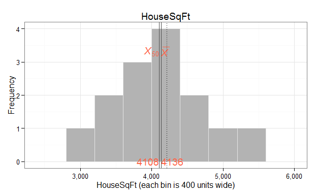
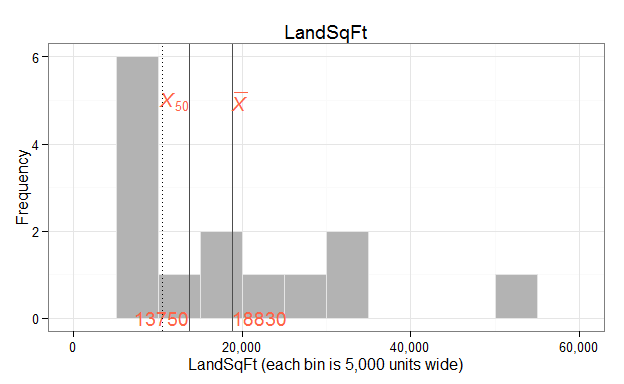
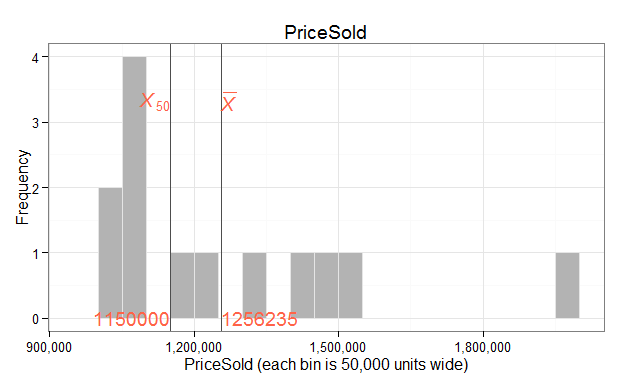
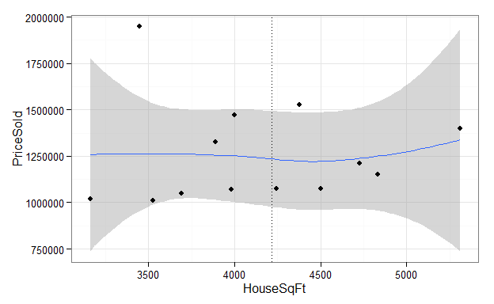
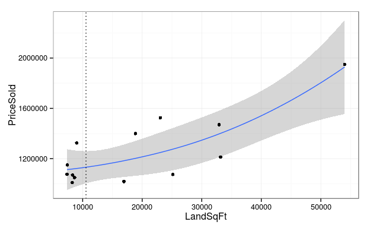
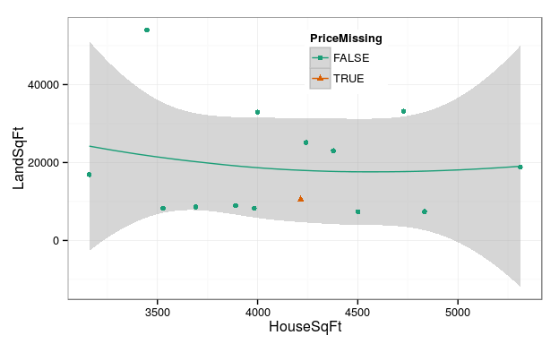
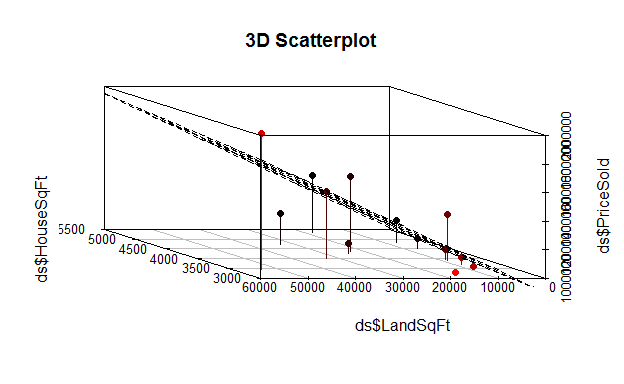
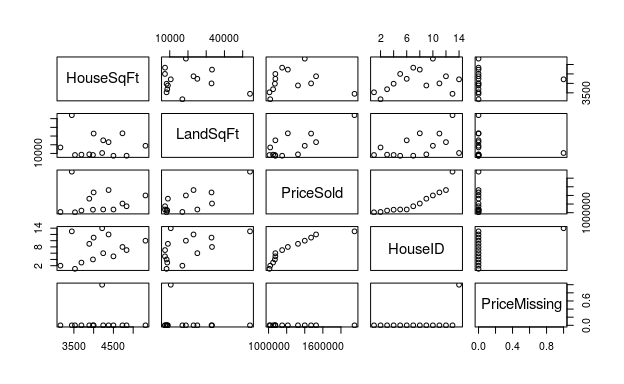

Skeleton Report 1
=================================================
This report covers the analyses used in the ZZZ project (Marcus Mark, PI).

<!--  Set the working directory to the repository's base directory; this assumes the report is nested inside of two directories.-->

```
## Working directory:  D:/Users/Will/Documents/GitHub/HousePrediction/analysis/report_1
```

<!-- Set the report-wide options, and point to the external code file. -->

```
## Working directory:  D:/Users/Will/Documents/GitHub/HousePrediction
```

<!-- Load the sources.  Suppress the output when loading sources. --> 


<!-- Load 'sourced' R files.  Suppress the output when loading packages. --> 


<!-- Load any global functions and variables declared in the R file.  Suppress the output. --> 


<!-- Declare any global functions specific to a Rmd output.  Suppress the output. --> 


<!-- Load the datasets.   -->


<!-- Tweak the datasets.   -->


```
   HouseSqFt LandSqFt PriceSold PriceMissing
1       3528     8250   1010000        FALSE
2       3160    16936   1018000        FALSE
3       3691     8643   1050000        FALSE
4       3983     8294   1070000        FALSE
5       4501     7377   1075000        FALSE
6       4242    25142   1075000        FALSE
7       4833     7421   1150000        FALSE
8       4729    33174   1213050        FALSE
9       3890     8992   1325000        FALSE
10      5311    18857   1400000        FALSE
11      4000    32912   1470000        FALSE
12      4378    23047   1525000        FALSE
13      3448    54014   1950000        FALSE
14      4215    10563        NA         TRUE
```
## Notes

# Marginals
   

# Scatterplots
   

# Models

```
============= Simple model with two main effects. =============
```

```

Call:
lm(formula = PriceSold ~ 1 + HouseSqFt + LandSqFt, data = ds)

Residuals:
    Min      1Q  Median      3Q     Max 
-282817  -45156   -6099  100655  242197 

Coefficients:
             Estimate Std. Error t value Pr(>|t|)
(Intercept) 769884.96  373130.12   2.063  0.06602
HouseSqFt       44.53      85.89   0.518  0.61544
LandSqFt        15.54       3.74   4.155  0.00197

Residual standard error: 181500 on 10 degrees of freedom
  (1 observation deleted due to missingness)
Multiple R-squared:  0.6333,	Adjusted R-squared:  0.5599 
F-statistic: 8.633 on 2 and 10 DF,  p-value: 0.006635
```

```
     14 
1121682 
```

```
============= Simple model with two main effects and an interaction. =============
```

```

Call:
lm(formula = PriceSold ~ 1 + HouseSqFt * LandSqFt, data = ds)

Residuals:
    Min      1Q  Median      3Q     Max 
-231874 -106755    9292   53676  243938 

Coefficients:
                     Estimate Std. Error t value Pr(>|t|)
(Intercept)        -2.175e+05  6.087e+05  -0.357   0.7291
HouseSqFt           3.000e+02  1.526e+02   1.966   0.0808
LandSqFt            6.555e+01  2.610e+01   2.512   0.0332
HouseSqFt:LandSqFt -1.309e-02  6.777e-03  -1.932   0.0854

Residual standard error: 160800 on 9 degrees of freedom
  (1 observation deleted due to missingness)
Multiple R-squared:  0.7408,	Adjusted R-squared:  0.6544 
F-statistic: 8.573 on 3 and 9 DF,  p-value: 0.005277
```

```
     14 
1156586 
```

# Graphs
  

# Session Information
For the sake of documentation and reproducibility, the current report was rendered on a system using the following software.


```
Report rendered by Will at 2015-09-09, 13:07 -0500
```

```
R version 3.2.2 Patched (2015-08-14 r69078)
Platform: x86_64-w64-mingw32/x64 (64-bit)
Running under: Windows >= 8 x64 (build 9200)

locale:
[1] LC_COLLATE=English_United States.1252  LC_CTYPE=English_United States.1252    LC_MONETARY=English_United States.1252
[4] LC_NUMERIC=C                           LC_TIME=English_United States.1252    

attached base packages:
[1] stats     graphics  grDevices utils     datasets  methods   base     

other attached packages:
[1] scatterplot3d_0.3-36 ggplot2_1.0.1        RColorBrewer_1.1-2   scales_0.3.0         knitr_1.11          

loaded via a namespace (and not attached):
 [1] Rcpp_0.12.0      digest_0.6.8     MASS_7.3-43      grid_3.2.2       plyr_1.8.3       gtable_0.1.2    
 [7] formatR_1.2      magrittr_1.5     evaluate_0.7.2   stringi_0.5-5    reshape2_1.4.1   rmarkdown_0.8   
[13] labeling_0.3     proto_0.3-10     tools_3.2.2      stringr_1.0.0    munsell_0.4.2    yaml_2.1.13     
[19] colorspace_1.2-6 htmltools_0.2.6 
```

# **Note 1**: The current report covers 14 houses.
