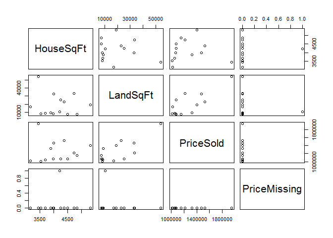

# minimal Example of External Code & External Dataset

<!--  Set the working directory to the repository's base directory; this assumes the report is nested inside of two directories.-->

```
## Working directory:  /home/wibeasley/GitHub/HousePrediction/analysis/report_minimal
```

<!-- Set the report-wide options, and point to the external code file. -->

```
## Working directory:  /home/wibeasley/GitHub/HousePrediction
```

<!-- Load the sources.  Suppress the output when loading sources. --> 


<!-- Load 'sourced' R files.  Suppress the output when loading packages. --> 


<!-- Load any global functions and variables declared in the R file.  Suppress the output. --> 


<!-- Declare any global functions specific to a Rmd output.  Suppress the output. --> 


<!-- Load the datasets.   -->


<!-- Tweak the datasets.   -->


# Print Dataset (from Rmd chunk)

```
   HouseSqFt LandSqFt PriceSold PriceMissing
1       3528     8250   1010000        FALSE
2       3160    16936   1018000        FALSE
3       3691     8643   1050000        FALSE
4       3983     8294   1070000        FALSE
5       4501     7377   1075000        FALSE
6       4242    25142   1075000        FALSE
7       4833     7421   1150000        FALSE
8       4729    33174   1213050        FALSE
9       3890     8992   1325000        FALSE
10      5311    18857   1400000        FALSE
11      4000    32912   1470000        FALSE
12      4378    23047   1525000        FALSE
13      3448    54014   1950000        FALSE
14      4215    10563        NA         TRUE
```
## Notes

# Print Dataset (through externalization)

```
   HouseSqFt LandSqFt PriceSold PriceMissing
1       3528     8250   1010000        FALSE
2       3160    16936   1018000        FALSE
3       3691     8643   1050000        FALSE
4       3983     8294   1070000        FALSE
5       4501     7377   1075000        FALSE
6       4242    25142   1075000        FALSE
7       4833     7421   1150000        FALSE
8       4729    33174   1213050        FALSE
9       3890     8992   1325000        FALSE
10      5311    18857   1400000        FALSE
11      4000    32912   1470000        FALSE
12      4378    23047   1525000        FALSE
13      3448    54014   1950000        FALSE
14      4215    10563        NA         TRUE
```

 

# Print Dataset (from Rmd text)
**Note 1**: The current report covers 14 houses.

# Session Information
For the sake of documentation and reproducibility, the current report was rendered on a system using the following software.


```
Report rendered by wibeasley at 2015-09-09, 23:10 -0500
```

```
R version 3.2.2 (2015-08-14)
Platform: x86_64-pc-linux-gnu (64-bit)
Running under: Ubuntu 14.04.3 LTS

locale:
 [1] LC_CTYPE=en_US.UTF-8       LC_NUMERIC=C               LC_TIME=en_US.UTF-8        LC_COLLATE=en_US.UTF-8    
 [5] LC_MONETARY=en_US.UTF-8    LC_MESSAGES=en_US.UTF-8    LC_PAPER=en_US.UTF-8       LC_NAME=C                 
 [9] LC_ADDRESS=C               LC_TELEPHONE=C             LC_MEASUREMENT=en_US.UTF-8 LC_IDENTIFICATION=C       

attached base packages:
[1] stats     graphics  grDevices utils     datasets  methods   base     

other attached packages:
[1] knitr_1.11.3

loaded via a namespace (and not attached):
 [1] magrittr_1.5       formatR_1.2        tools_3.2.2        htmltools_0.2.6    yaml_2.1.13        stringi_0.5-5     
 [7] rmarkdown_0.8      stringr_1.0.0.9000 digest_0.6.8       evaluate_0.7.2    
```
